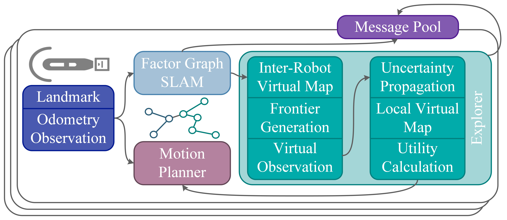

# Multi Robot EM Exploration
**This is the implementation of our autonomous exploration algorithm designed for decentralized multi-robot teams, which takes into account map and localization uncertainties of range-sensing
mobile robots. Virtual landmarks are used to quantify the combined impact of process noise and sensor noise on map uncertainty. Additionally, we employ an iterative expectation-maximization inspired algorithm to assess the potential outcomes of both a local robot’s and its neighbors’ next-step actions.**
<p align="center"></p>

##
 - Here we provide a 2D example.
 - The Environment and local motion planner used in this repo is from our IROS 2023 paper [here](https://github.com/RobustFieldAutonomyLab/Distributional_RL_Navigation).
```
  ├── Multi-Robot-EM-Exploration
     ├── marinenav_env          # IROS 2023 Environment
     ├── nav                    # Exploration and SLAM code
     ├── scripts/test
     │   └── test_multi_SALM.py # 2D example
     └── ...
```
# Dependencies
- numpy
- scipy
- gtsam
- tqdm
- matplotlib

## How to use
```bash
python3 scripts/test/test_multi_SALM.py 
```
